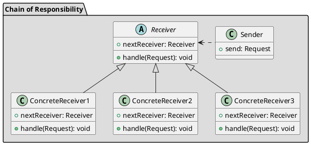

## Назначение

Удаление связи между отправителем запроса и его получателем, предоставляя нескольким объектам возможность обработать запрос. 
Объекты-получатели объединяются в цепочку и запрос передается по цепочке, пока какой-либо объект не обработает его.

## UML



## Принцип работы

1. Каждый обработчик в цепочке имеет свою реализацию для реагирования на событие
2. Каждый обработчик должен иметь ссылку на следующий обработчик (или null)
3. Каждый обработчик должен передавать управление следующему обработчику, если не может обработать событие сам. 
4. Сслыки между обработчиками не должны быть цикличными
5. Обработчик, который первым в цепочке может обработать событие - завершает цепочку вызовов. 

## Преимущества

+ Позволяет разделить отправителя и получателя комманды
+ Выбор стратегии обработки события динамически

## Недостатки

+ Легко сделать ошибку:
    + Если забыть вызвать следующий обработчик
    + Если вызвать не тот обработчик, то может привести к бесконечному циклу
+ Может создавать глубокий стек вызовов, который сложно отлаживать
+ Может привести к дублированию кода в обработчиках

## Пример

**Обработка запросов аутентификации**

```java
public abstract class AuthenticationProcessor {
    public AuthenticationProcessor nextProcessor;
    
    public abstract boolean isAuthorized(AuthenticationProvider authProvider);
}

public class OAuthProcessor extends AuthenticationProcessor {
    public OAuthProcessor(AuthenticationProcessor nextProcessor) {
        super(nextProcessor);
    }

    @Override
    public boolean isAuthorized(AuthenticationProvider authProvider) {
        if (authProvider instanceof OAuthTokenProvider) {
            return true;
        } else if (nextProcessor != null) {
            return nextProcessor.isAuthorized(authProvider);
        }
        
        return false;
    }
}

public class UsernamePasswordProcessor extends AuthenticationProcessor {
    public UsernamePasswordProcessor(AuthenticationProcessor nextProcessor) {
        super(nextProcessor);
    }

    @Override
    public boolean isAuthorized(AuthenticationProvider authProvider) {
        if (authProvider instanceof UsernamePasswordProvider) {
            return true;
        } else if (nextProcessor != null) {
            return nextProcessor.isAuthorized(authProvider);
        }
    return false;
    }
}

public class ChainOfResponsibilityTest {
    private static AuthenticationProcessor getChainOfAuthProcessor() {
        return new UsernamePasswordProcessor(
            new OAuthProcessor(null)
        );
    }

    @Test
    public void givenOAuthProvider_whenCheckingAuthorized_thenSuccess() {
        AuthenticationProcessor authProcessorChain = getChainOfAuthProcessor();
        assertTrue(authProcessorChain.isAuthorized(new OAuthTokenProvider()));
    }

    @Test
    public void givenSamlProvider_whenCheckingAuthorized_thenFail() {
        AuthenticationProcessor authProcessorChain = getChainOfAuthProcessor();
 
        assertFalse(authProcessorChain.isAuthorized(new SamlTokenProvider()));
    }
}
```


