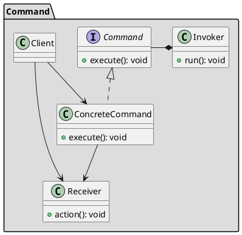

## Назначение

Предназначен для инкапсуляции в объект всех данных, необходимых для выполнения заданного действия (команды), включая то, какой метод вызвать, аргументы метода и объект, которому принадлежит метод. Позволяет отделить объекты, производящие команды, от их потребителей.

## UML


**ConcreteCommand** - объект, роль которого заключается в хранении всей информации, необходимой для выполнения действия, включая метод для вызова, аргументы метода и объект (известный как приемник), который реализует метод.

**Invoker** - объект, который знает, как выполнить заданную команду, но не знает детали реализации.

**Receiver** - объект, который выполняет действия.

**Client** - объект, который управляет процессом выполнения команд, указывая, какие команды и на каких этапах процесса выполнять.

## Принцип работы


## Преимущества

+ Делает код расширяемым, поскольку позволяет добавлять новые команды без изменения существующего кода

+ Уменьшает связность между Invoker и Receiver

+ Позволяет создавать последовательность команд

+ Можно легко добавить новую команду без изменения существующего кода

+ Позволяет создать систему для отката изменений 

+ Позволяет создать систему логирования производимых действий

## Недостатки

+ Большое количество классов


## Пример

```java
public interface Command {
  void execute();
  void revert();
}

public interface Vehicle {
  void start();
  void stop();
  void accelerate();
}

public class Motorcycle implements Vehicle {
  @Override
  public void start() {
    System.out.println("Starting motorcycle...");
  }

  @Override
  public void stop() {
    System.out.println("Stopping motorcycle...");
  }

  @Override
  public void accelerate() {
    System.out.println("Accelerating motorcycle...");
  }
}

public class Truck implements Vehicle {
  @Override
  public void start() {
    System.out.println("Starting truck...");
  }

  @Override
  public void stop() {
    System.out.println("Stopping truck...");
  }

  @Override
  public void accelerate() {
    System.out.println("Accelerating truck...");
  }

  @Override
  public void decelerate() {
    System.out.println("Decelerating truck...");
  }
}

public class GhostRider {
  Command command;

  public GhostRider(Command command){
    this.command = command;
  }

  public void setCommand(Command command) {
    this.command = command;
  }

  public void takeAction(){
    command.execute();
  }

  public void revertAction() {
    command.revert();
  }
}

public class StartMotorcycle implements Command {
  Vehicle vehicle;

  public StartMotorcycle(Vehicle vehicle) {
    this.vehicle = vehicle;
  }

  public void execute() {
    vehicle.start();
  }

  @Override
  public void revert() {
    vehicle.stop();
  }
}

public class AccelerateMotorcycle implements Command {
  Vehicle vehicle;

  public AccelerateMotorcycle(Vehicle vehicle){
    this.vehicle = vehicle;
  }

  public void execute() {
    vehicle.accelerate();
  }

  @Override
  public void revert() {
    vehicle.decelerate();
  }
}

public class StartAllVehicles implements Command {
  List<Vehicle> vehicles;

  public StartAllVehicles(List<Vehicle> vehicles) {
    this.vehicles = vehicles;
  }

  public void execute() {
    vehicles.forEach(vehicle -> vehicle.start());
  }

  @Override
  public void revert() {
    vehicles.forEach(vehicle -> vehicle.stop());
  }
}

public class RideVehicle {
  public static void main(String[] args) {
    Vehicle motorcycle = new Motorcycle();

    StartMotorcycle startCommand = new StartMotorcycle(motorcycle);
    GhostRider ghostRider = new GhostRider(startCommand);
    ghostRider.takeAction();

    AccelerateMotorcycle accelerateCommand = new AccelerateMotorcycle(motorcycle);
    ghostRider.setCommand(accelerateCommand);
    ghostRider.takeAction();
    ghostRider.revertAction();

    Vehicle truck = new Truck();
    List<Vehicle> vehicles = List.of(motorcycle, truck);
    StartAllVehicles startAllVehicles = new StartAllVehicles(vehicles);
    startAllVehicles.execute();
    startAllVehicles.revert();
  }
}
```


