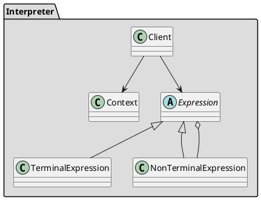

## Назначение

Позволяет автоматизированно и гибко обрабатывать выражения, предоставляемые в качестве входных данных пользователями через клиентский код.

Целью использования паттерна интерпретатора является обработка вводимых пользователем выражений и построение абстрактного синтаксического дерева (AST). Это AST является экземпляром шаблона [Composite]( "Composite"). Затем понадобится синтаксический анализатор для разбора AST и создания выходных данных.

## UML



## Принцип работы

Для интерпретации выражения создаются терминальные и не терминальные классы, которые описывают структуру выражения в виде абстрактного синтаксического дерева. После того как выражение из простого языка переведено в AST - его можно вычислять.

## Преимущества

-   Реализация проста, так как почти все классы выражений имеют аналогичную реализацию.

## Недостатки

-   Когда грамматика усложняется, ее становится труднее поддерживать.

## Пример

Чтобы показать паттерн в действии, мы построим простой SQL-подобный синтаксис в объектно-ориентированном виде, который затем будет интерпретирован и вернет нам результат.

Сначала мы определим выражения Select, From и Where, построим дерево синтаксиса в классе клиента и запустим интерпретацию.

```java
class Select implements Expression {

    private String column;
    private From from;

    // constructor

    @Override
    public List<String> interpret(Context ctx) {
        ctx.setColumn(column);
        return from.interpret(ctx);
    }
}

class From implements Expression {

    private String table;
    private Where where;

    // constructors

    @Override
    public List<String> interpret(Context ctx) {
        ctx.setTable(table);
        if (where == null) {
            return ctx.search();
        }
        return where.interpret(ctx);
    }
}

class Where implements Expression {

    private Predicate<String> filter;

    // constructor

    @Override
    public List<String> interpret(Context ctx) {
        ctx.setFilter(filter);
        return ctx.search();
    }
}

class Context {

    private static Map<String, List<Row>> tables = new HashMap<>();

    static {
        List<Row> list = new ArrayList<>();
        list.add(new Row("John", "Doe"));
        list.add(new Row("Jan", "Kowalski"));
        list.add(new Row("Dominic", "Doom"));

        tables.put("people", list);
    }

    private String table;
    private String column;
    private Predicate<String> whereFilter;

    // ...

    List<String> search() {

        List<String> result = tables.entrySet()
          .stream()
          .filter(entry -> entry.getKey().equalsIgnoreCase(table))
          .flatMap(entry -> Stream.of(entry.getValue()))
          .flatMap(Collection::stream)
          .map(Row::toString)
          .flatMap(columnMapper)
          .filter(whereFilter)
          .collect(Collectors.toList());

        clear();

        return result;
    }
}

public class InterpreterDemo {
    public static void main(String[] args) {

        Expression query = new Select("name", new From("people"));
        Context ctx = new Context();
        List<String> result = query.interpret(ctx);
        System.out.println(result);

        Expression query2 = new Select("*", new From("people"));
        List<String> result2 = query2.interpret(ctx);
        System.out.println(result2);

        Expression query3 = new Select("name",
          new From("people",
            new Where(name -> name.toLowerCase().startsWith("d"))));
        List<String> result3 = query3.interpret(ctx);
        System.out.println(result3);
    }
}

```
