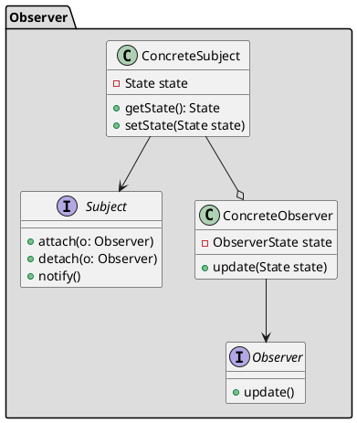

## Назначение

Согласно определению GoF, паттерн **Observer** определяет зависимость "один-ко-многим" между объектами таким образом, что когда один объект изменяет состояние, все его зависимые объекты уведомляются и обновляются автоматически. Его также называют паттерном **Publish-Subscribe**.

## UML



## Принцип работы

В паттерне Observer существует множество наблюдателей (объектов-подписчиков), которые наблюдают за определенным субъектом (объектом-издателем). Наблюдатели регистрируют себя на объекте, чтобы получить уведомление, когда в этом объекте происходят изменения.

Объект-наблюдатель может зарегистрироваться или отсоединиться от субъекта в любой момент времени. Это помогает сделать объекты слабо связанными друг с другом.

## Преимущества

1. **Слабая связность**: Наблюдатели и субъекты слабо связаны друг с другом. Это позволяет легко добавлять или удалять наблюдателей.

2. **Возможность повторного использования**: Наблюдатели могут быть повторно использованы для нескольких субъектов, а субъекты могут иметь несколько наблюдателей.

3. **Масштабируемость**: Модель наблюдателя можно легко масштабировать для работы с большим количеством наблюдателей и субъектов.

## Недостатки

1. **Накладные расходы на производительность**: Модель наблюдателя может добавить некоторые накладные расходы в систему, поскольку она требует, чтобы субъект уведомлял каждого наблюдателя при каждом изменении своего состояния. Это может привести к низкой производительности, особенно в системах с большим количеством наблюдателей.

2. **Сложность**: Модель наблюдателя может внести сложность в систему, поскольку она требует отслеживания множества объектов и их отношений.

3. **Порядок обновления**: Может быть трудно обеспечить, чтобы наблюдатели получали уведомления в определенном порядке, что может вызвать проблемы с зависимостями между компонентами.

## Пример

```java
public class Newsletter implements Subject {

    protected List<Observer> observers = new ArrayList<>();
    protected String name;
    protected String newEmail;

    public Newsletter(String name) {
        this.name = name;
    }

    public void addNewEmail(String newEmail) {
        this.newEmail = newEmail;
        notify();
    }

    @Override
    public void attach(Observer observer) {
        observers.add(observer);
    }

    @Override
    public void detach(Observer observer) {
        observers.remove(observer);
    }

    @Override
    public void notify() {
        observers.forEach(observer -> observer.update(newEmail));
    }
}

class Subscriber implements Observer {

  private String name;

  public Subscriber(String name) {
    this.name = name;
  }

  @Override
  public void update(String newEmail) {
    System.out.println("Email for: " + name + " | Content:" + newEmail);
  }

}

public class SendEmailMain {

  public static void main(String[] args) {
    Newsletter newsLetter = new Newsletter("Java Challengers");

    Observer duke = new Subscriber("Duke");
    Observer juggy = new Subscriber("Juggy");
    Observer dock = new Subscriber("Moby Dock");

    newsLetter.attach(duke);
    newsLetter.addNewEmail("Lambda Java Challenge");
    newsLetter.detach(duke);

    newsLetter.attach(juggy);
    newsLetter.attach(dock);
    newsLetter.addNewEmail("Virtual Threads Java Challenge");
  }

}
```
