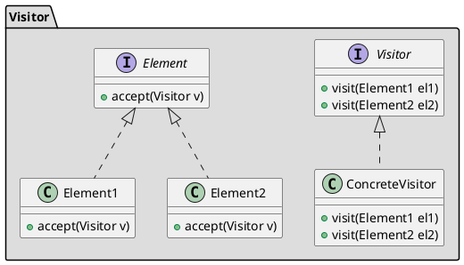

## Назначение

Основная цель Visitor - абстрагировать функциональность, которая может быть применена к иерархии объектов. Этот подход способствует разработке облегченных классов Element, поскольку функциональность обработки исключена из списка их обязанностей. Новая функциональность может быть легко добавлена к исходной иерархии наследования путем создания нового подкласса Visitor.

## UML



## Принцип работы

-   Убедиться, что текущая иерархия элементов будет достаточно стабильной и что публичный интерфейс этих классов открыт для доступа, который потребуется классам Visitor. Если эти условия не выполняются, то шаблон Visitor не подходит.
-   Создать базовый класс Visitor с методом visit(ElementXxx) для каждого производного типа Element.
-   Добавить метод accept(Visitor) в иерархию элементов. Реализация в каждом производном классе Element всегда одна и та же - accept( Visitor v ) { v.visit( this ); }.
-   Иерархия Element связана только с базовым классом Visitor, но иерархия Visitor связана с каждым производным классом Element. Если стабильность иерархии Element низкая, а стабильность иерархии Visitor высокая, подумайте о том, чтобы поменять местами "роли" этих двух иерархий.
-   Создать производный класс Visitor для каждой "операции", которая будет выполняться над объектами Element. Реализации visit() будут полагаться на публичный интерфейс Element.
-   Клиент создает объекты Visitor и передает их объектам Element, вызывая функцию accept().

## Преимущества

-   Если логика работы изменяется, то нам нужно внести изменения только в реализацию Visitor, а не делать это во всех классах элементов.
-   Добавить новый элемент в систему очень просто, для этого потребуется внести изменения только в интерфейс и реализацию посетителя, а существующие классы элементов не будут затронуты.

## Недостатки

Мы должны знать возвращаемый тип методов visit() во время проектирования, иначе нам придется изменить интерфейс и все его реализации. Другим недостатком является то, что если существует слишком много реализаций интерфейса visitor, то его трудно расширять.

## Пример

```java
public interface ItemElement {
	public int accept(ShoppingCartVisitor visitor);
}

public class Book implements ItemElement {
	private int price;
	private String isbnNumber;

	public Book(int cost, String isbn){
		this.price=cost;
		this.isbnNumber=isbn;
	}

	public int getPrice() {
		return price;
	}

	public String getIsbnNumber() {
		return isbnNumber;
	}

	@Override
	public int accept(ShoppingCartVisitor visitor) {
		return visitor.visit(this);
	}
}

public class Fruit implements ItemElement {
	private int pricePerKg;
	private int weight;
	private String name;

	public Fruit(int priceKg, int wt, String nm){
		this.pricePerKg=priceKg;
		this.weight=wt;
		this.name = nm;
	}

	public int getPricePerKg() {
		return pricePerKg;
	}

	public int getWeight() {
		return weight;
	}

	public String getName(){
		return this.name;
	}

	@Override
	public int accept(ShoppingCartVisitor visitor) {
		return visitor.visit(this);
	}
}

public interface ShoppingCartVisitor {
	int visit(Book book);
	int visit(Fruit fruit);
}

public class ShoppingCartVisitorImpl implements ShoppingCartVisitor {
	@Override
	public int visit(Book book) {
		int cost=0;
		//apply 5$ discount if book price is greater than 50
		if(book.getPrice() > 50){
			cost = book.getPrice()-5;
		}else cost = book.getPrice();
		System.out.println("Book ISBN::"+book.getIsbnNumber() + " cost ="+cost);
		return cost;
	}

	@Override
	public int visit(Fruit fruit) {
		int cost = fruit.getPricePerKg()*fruit.getWeight();
		System.out.println(fruit.getName() + " cost = "+cost);
		return cost;
	}
}

public class ShoppingCartClient {
	public static void main(String[] args) {
		ItemElement[] items = new ItemElement[]{new Book(20, "1234"),new Book(100, "5678"),
				new Fruit(10, 2, "Banana"), new Fruit(5, 5, "Apple")};

		int total = calculatePrice(items);
		System.out.println("Total Cost = "+total);
	}

	private static int calculatePrice(ItemElement[] items) {
		ShoppingCartVisitor visitor = new ShoppingCartVisitorImpl();
		int sum=0;
		for(ItemElement item : items){
			sum = sum + item.accept(visitor);
		}
		return sum;
	}
}
```
