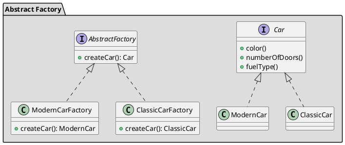

## Назначение

Предоставить интерфейс для создания семейств связанных или зависимых объектов без указания их конкретных классов.
В отличии от шаблона Factory, где в методе создания объектов происходит ветвление в зависимости от входных параметров, в паттерне Abstract Factory мы избавляемся от блока if-else и имеем класс фабрики для каждого подкласса.
Короче говоря, абстрактная фабрика предоставляет интерфейс для создания различных конкретных фабрик. Каждая такая фабрика работает с семейством или группой объектов и, следовательно, абстрактная фабрика предоставляет возможность работать с несколькими такими фабриками. Поэтому мы также можем назвать ее фабрикой фабрик.

## UML



## Принцип работы

Cоздать интерфейс AbstractFactory, который можно использовать как общую структуру для определения конкретной фабрики. Эти конкретные фабрики теперь могут быть использованы для создания объектов соответствующего семейства.

## Пример

```java
public abstract class Computer {
    public abstract String getRAM();
    public abstract String getHDD();
    public abstract String getCPU();

    @Override
    public String toString(){
        return "RAM= "+this.getRAM()+", HDD="+this.getHDD()+", CPU="+this.getCPU();
    }
}

public class PC extends Computer {
    private String ram;
    private String hdd;
    private String cpu;

    public PC(String ram, String hdd, String cpu){
        this.ram=ram;
        this.hdd=hdd;
        this.cpu=cpu;
    }
    @Override
    public String getRAM() {
        return this.ram;
    }

    @Override
    public String getHDD() {
        return this.hdd;
    }

    @Override
    public String getCPU() {
        return this.cpu;
    }
}

public class Server extends Computer {
    private String ram;
    private String hdd;
    private String cpu;

    public Server(String ram, String hdd, String cpu){
        this.ram=ram;
        this.hdd=hdd;
        this.cpu=cpu;
    }
    @Override
    public String getRAM() {
        return this.ram;
    }

    @Override
    public String getHDD() {
        return this.hdd;
    }

    @Override
    public String getCPU() {
        return this.cpu;
    }
}

public interface ComputerAbstractFactory {
	public Computer createComputer();
}

public class PCFactory implements ComputerAbstractFactory {
	private String ram;
	private String hdd;
	private String cpu;

	public PCFactory(String ram, String hdd, String cpu){
		this.ram=ram;
		this.hdd=hdd;
		this.cpu=cpu;
	}

	@Override
	public Computer createComputer() {
		return new PC(ram,hdd,cpu);
	}
}

public class ServerFactory implements ComputerAbstractFactory {
	private String ram;
	private String hdd;
	private String cpu;

	public ServerFactory(String ram, String hdd, String cpu){
		this.ram=ram;
		this.hdd=hdd;
		this.cpu=cpu;
	}

	@Override
	public Computer createComputer() {
		return new Server(ram,hdd,cpu);
	}
}

public class ComputerFactory {
	public static Computer getComputer(ComputerAbstractFactory factory){
		return factory.createComputer();
	}
}

public class TestDesignPatterns {
	public static void main(String[] args) {
		testAbstractFactory();
	}

	private static void testAbstractFactory() {
		Computer pc = ComputerFactory.getComputer(new PCFactory("2 GB","500 GB","2.4 GHz"));
		Computer server = ComputerFactory.getComputer(new ServerFactory("16 GB","1 TB","2.9 GHz"));
		System.out.println("AbstractFactory PC Config::"+pc);
		System.out.println("AbstractFactory Server Config::"+server);
	}
}
```
