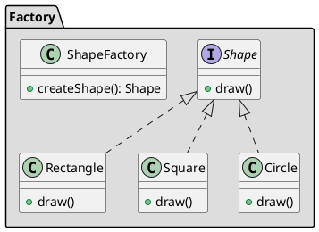

## Назначение

Шаблон Factory используется, когда у нас есть суперкласс с несколькими подклассами, и на основе входных данных нам нужно вернуть один из подклассов. Этот паттерн переносит ответственность за инстанцирование класса с клиентской программы на класс-фабрику.

## UML



## Принцип работы

1. Определить какие аргументы метода фабрики необходимы и достаточны для определения правильного производного класса для инстанцирования?
2. Подумать о создании внутреннего "пула объектов", который позволит использовать объекты повторно, а не создавать их с нуля.
3. Рассмотреть возможность сделать все конструкторы приватными или защищенными.

## Пример

```java
public abstract class Computer {
	public abstract String getRAM();
	public abstract String getHDD();
	public abstract String getCPU();

	@Override
	public String toString(){
		return "RAM= "+this.getRAM()+", HDD="+this.getHDD()+", CPU="+this.getCPU();
	}
}

public class PC extends Computer {
	private String ram;
	private String hdd;
	private String cpu;

	public PC(String ram, String hdd, String cpu){
		this.ram=ram;
		this.hdd=hdd;
		this.cpu=cpu;
	}
	@Override
	public String getRAM() {
		return this.ram;
	}

	@Override
	public String getHDD() {
		return this.hdd;
	}

	@Override
	public String getCPU() {
		return this.cpu;
	}
}

public class Server extends Computer {
	private String ram;
	private String hdd;
	private String cpu;

	public Server(String ram, String hdd, String cpu){
		this.ram=ram;
		this.hdd=hdd;
		this.cpu=cpu;
	}
	@Override
	public String getRAM() {
		return this.ram;
	}

	@Override
	public String getHDD() {
		return this.hdd;
	}

	@Override
	public String getCPU() {
		return this.cpu;
	}
}

public class ComputerFactory {
	public static Computer getComputer(String type, String ram, String hdd, String cpu){
		if("PC".equalsIgnoreCase(type)) return new PC(ram, hdd, cpu);
		else if("Server".equalsIgnoreCase(type)) return new Server(ram, hdd, cpu);

		return null;
	}
}

public class TestFactory {
	public static void main(String[] args) {
		Computer pc = ComputerFactory.getComputer("pc","2 GB","500 GB","2.4 GHz");
		Computer server = ComputerFactory.getComputer("server","16 GB","1 TB","2.9 GHz");
		System.out.println("Factory PC Config::"+pc);
		System.out.println("Factory Server Config::"+server);
	}
}
```
